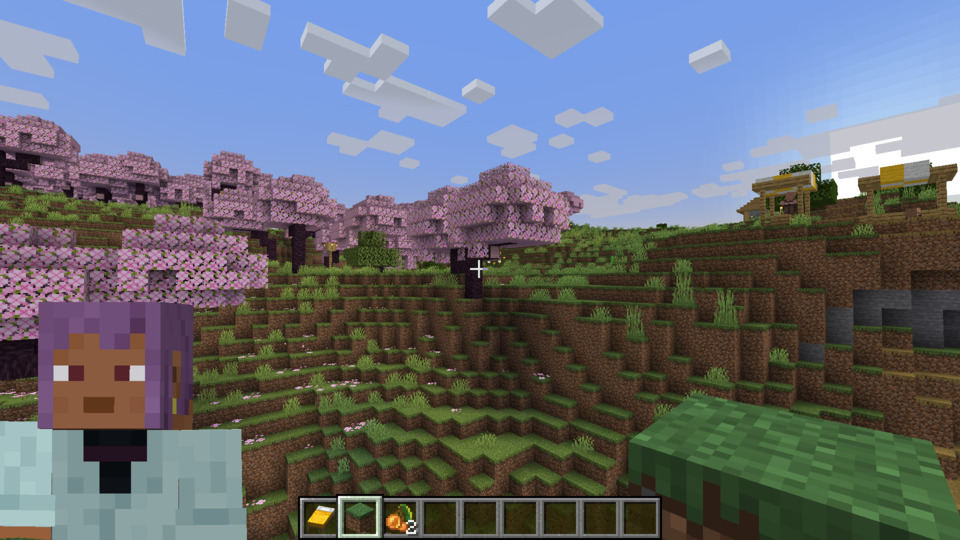
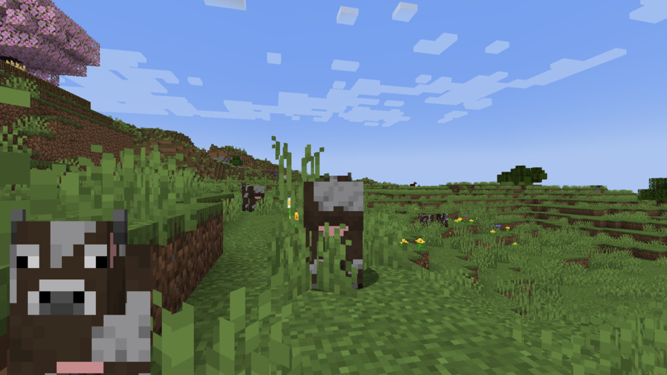
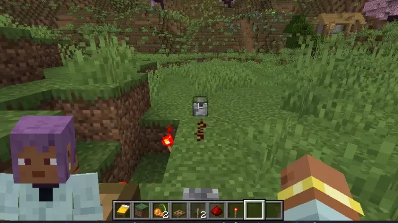
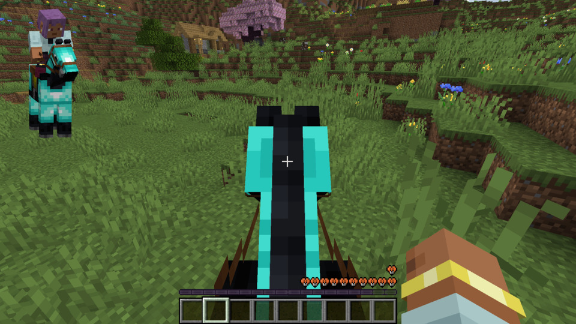
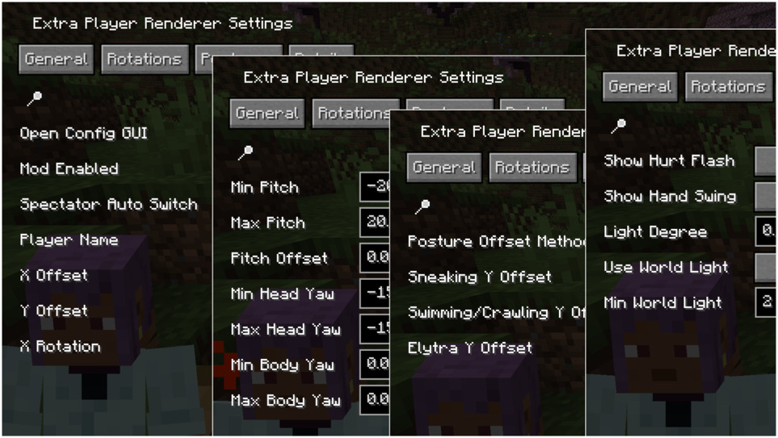

# Extra Player Renderer

For Minecraft 1.21+, malilib should be downloaded from <a href="https://github.com/sakura-ryoko/malilib/releases">sakura-ryoko's fork</a>.

*If you are looking for the same mod but for Forge, [click here](https://www.curseforge.com/minecraft/mc-mods/extra-player-render). It's not developed by me but still good to use.*

In short, this mod renders a player model in the bottom left corner (by default, configurable) of the screen. Adaptable & configurable. That's it.

## Features

In spectator mode, the rendered model gets automatically changed into the entity that your view is attached to.

When the player's posture changes, the position of the rendered model changes smoothly.

The riding entity can also be rendered, so you can show your favourite horse.

## Fully Configurable

By pressing F8 in game (by default, configurable as well), the configuration screen will pop up.

Explore the tabs and buttons, there are a lot for you to config: the scale, position and rotation of the figure, the head & body rotations, how to offset(transit) between postures and angle of light on the figure...

## Downloads & Dependencies

Downloading this mod from [CurseForge](https://www.curseforge.com/minecraft/mc-mods/extraplayerrenderer) or [Modrinth](https://modrinth.com/mod/7q8r8AtY) is recommended, as this can help me gain some rewards.

You can also download from [GitHub](https://github.com/LucunJi/ExtraPlayerRenderer) or [mcmod](https://www.mcmod.cn/class/2374.html).

This mod requires masa's [malilib](https://www.curseforge.com/minecraft/mc-mods/malilib).

For Minecraft 1.21+, malilib should be downloaded from <a href="https://github.com/sakura-ryoko/malilib/releases">sakura-ryoko's fork</a>.

[Mod Menu](https://modrinth.com/mod/modmenu/) is an optional dependency for the latest versions.

Some earlier versions (now obsolete) requires [Fabric API](https://www.curseforge.com/minecraft/mc-mods/fabric-api).

## Issues
When facing any issue, please first try to update the dependencies (malilib and Fabric Loader),
and then report the bug in [GitHub Issues](https://github.com/LucunJi/ExtraPlayerRenderer/issues) if the issue persists (I rarely look into other places other than GitHub).

This mod is compatible *in theory* with other mods that modifies player's model.
But such compatibility comes from the structure of vanilla Minecraft code, and is *not intended*. Glitches can happen.
You may submit compatibility requests to GitHub Issues.
