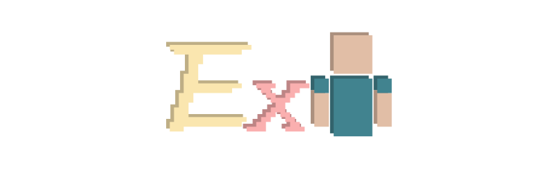

# Extra Player Renderer

**In short, this mod:**

1. Displays a player model on the screen
2. Does not depend on other mods (since version 3.0.0)
3. Is highly configurable

That's it!

*If you are looking for the same mod but for
Forge, [click here](https://www.curseforge.com/minecraft/mc-mods/extra-player-render). It's not developed by me but
still good to use.*

## Features

When the player's posture changes, the position of the rendered model changes smoothly.

The riding entity can also be rendered, so you can show your favorite horse.

In spectator mode, the rendered model gets automatically changed into the entity that your view is attached to.

## Fully Configurable

When F8 is pressed in game, the configuration screen pops up.

Explore the tabs and buttons, there are a lot for you to config: the scale, position and rotation of the player model,
the head & body's rotations, how to offset (transit) between postures, angle of light on the figure, and so on.

## Downloads & Dependencies

Downloading this mod from [CurseForge](https://www.curseforge.com/minecraft/mc-mods/extraplayerrenderer)
or [Modrinth](https://modrinth.com/mod/7q8r8AtY) is recommended, as this can help me gain some rewards.

You can also download from [GitHub](https://github.com/LucunJi/ExtraPlayerRenderer)
or [mcmod](https://www.mcmod.cn/class/2374.html).

This mod depends on:

- v3.0.0 and above:
    - Really NOTHING, just install fabric loader as usual
- before v3.0.0:
    - For Minecraft 1.21+
        - [malilib from sakura-ryoko's fork](https://github.com/sakura-ryoko/malilib/releases)
    - For Minecraft earlier than 1.21
        - [malilib](https://modrinth.com/mod/malilib)
- Optionally, install [Mod Menu](https://modrinth.com/mod/modmenu)
- Some very early versions (now obsolete) also requires [Fabric API](https://modrinth.com/mod/fabric-api)
- Some alpha versions require both Fabric API and [YACL](https://modrinth.com/mod/yacl)

## Issues

When facing any issue, please first try to update the mod and Fabric Loader,
and then report the bug in [GitHub Issues](https://github.com/LucunJi/ExtraPlayerRenderer/issues) if the issue
persists (I rarely look into other places other than GitHub).

This mod is compatible *in theory* with other mods that modifies player's model.
But such compatibility comes from the structure of vanilla Minecraft code, and is *not intended*. Glitches can happen.
You may submit compatibility requests to GitHub Issues.
